# Lab 07 — Pare-feu UFW et contrôle des accès

## Objectif

Installer, configurer et tester le pare-feu UFW sur Ubuntu Server afin de contrôler les connexions entrantes et sortantes des services SSH et Apache.

## Environnement

- Ubuntu Server
- Windows
- VirtualBox
- UFW
- OpenSSH
- Apache2
- Réseau privé hôte

## Vérification des services et de l’état d’UFW

La présence du pare-feu UFW ainsi que son état initial ont été vérifiés.

Commandes utilisées :

```bash
sudo ufw status
sudo systemctl status ssh
sudo systemctl status apache2
```

Le pare-feu UFW est présent mais inactif au début de la manipulation.

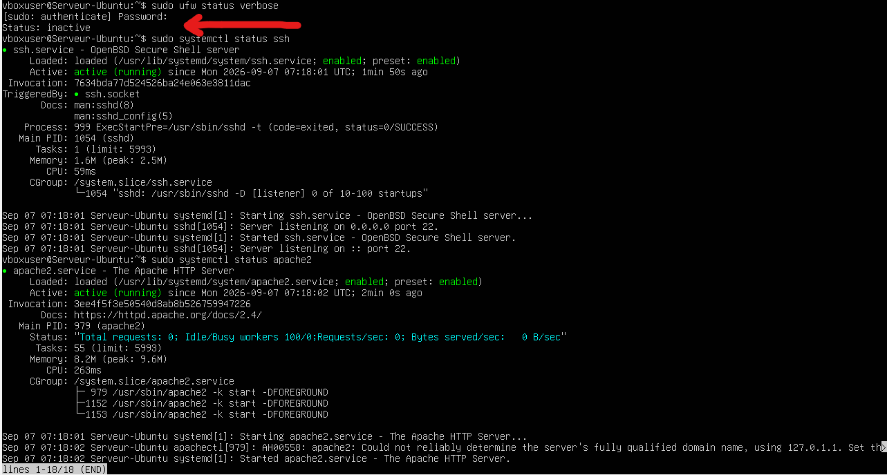

## Autorisation du service SSH

Une règle a été ajoutée afin d’autoriser les connexions SSH à travers le pare-feu.

Commande utilisée :

```bash
sudo ufw allow ssh
```

Cette règle autorise le port 22 utilisé par le service SSH.

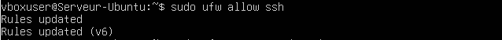

## Autorisation d’Apache et vérification des accès

Une règle a été ajoutée pour autoriser Apache, puis les accès aux services SSH et HTTP ont été vérifiés.

Commandes utilisées :

```bash
sudo ufw allow 'Apache'
sudo ufw status numbered
```

Tests réalisés depuis Windows :

```powershell
Test-NetConnection ADRESSE_IP_UBUNTU -Port 22
Test-NetConnection ADRESSE_IP_UBUNTU -Port 80
```

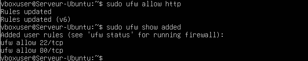

## Définition des règles par défaut

Les règles générales du pare-feu ont été définies comme suit :

- Connexions entrantes refusées par défaut.
- Connexions sortantes autorisées par défaut.

Commandes utilisées :

```bash
sudo ufw default deny incoming
sudo ufw default allow outgoing
```

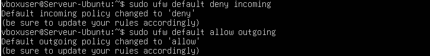

## Activation du pare-feu

Le pare-feu UFW a ensuite été activé et son état a été contrôlé.

Commandes utilisées :

```bash
sudo ufw enable
sudo ufw status verbose
```

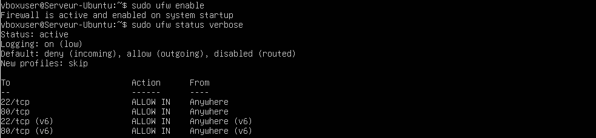

## Vérification des connexions sortantes depuis Ubuntu

Les connexions sortantes depuis Ubuntu fonctionnent toujours, car la politique par défaut autorise les connexions sortantes.

Commandes utilisées :

```bash
ping -c 4 8.8.8.8
ping -c 4 ubuntu.com
curl http://ubuntu.com
```

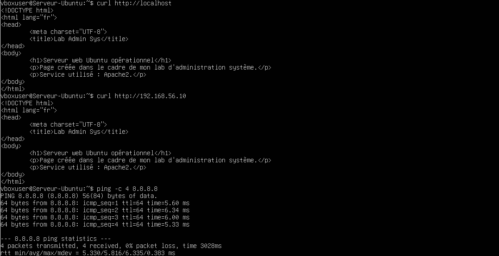

## Vérification des connexions entrantes depuis Windows

Les services explicitement autorisés restent accessibles depuis Windows.

Tests utilisés :

```powershell
Test-NetConnection ADRESSE_IP_UBUNTU -Port 22
Test-NetConnection ADRESSE_IP_UBUNTU -Port 80
```

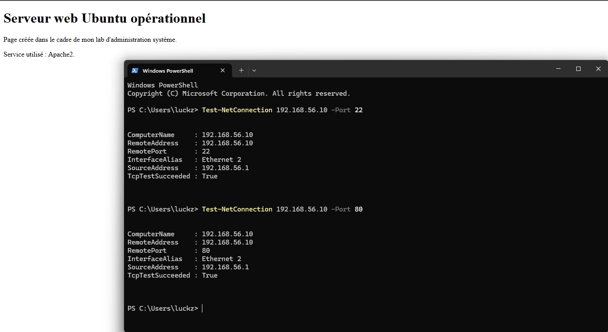

## Blocage du trafic HTTP

La règle d’autorisation HTTP a été supprimée ou désactivée afin de vérifier le blocage du port 80.

Commandes utilisées :

```bash
sudo ufw delete allow 'Apache'
sudo ufw status numbered
```

Des tests ont ensuite été réalisés depuis Ubuntu et Windows afin d’observer la différence entre une connexion sortante et une connexion entrante.

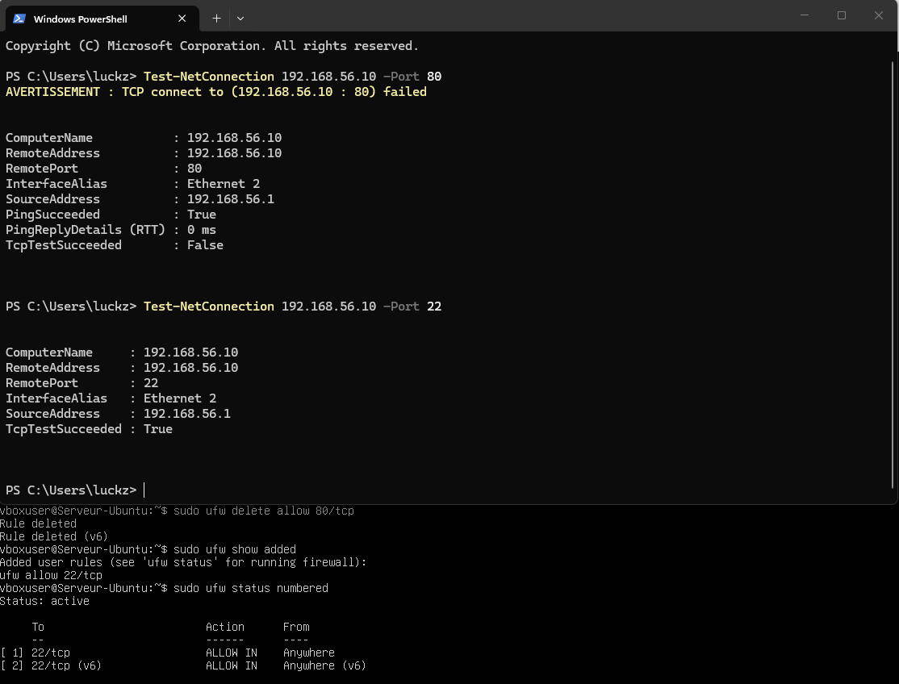

## Rétablissement de l’autorisation Apache

L’autorisation du service Apache a été rétablie afin de rendre à nouveau le serveur web accessible.

Commande utilisée :

```bash
sudo ufw allow 'Apache'
sudo ufw status
```

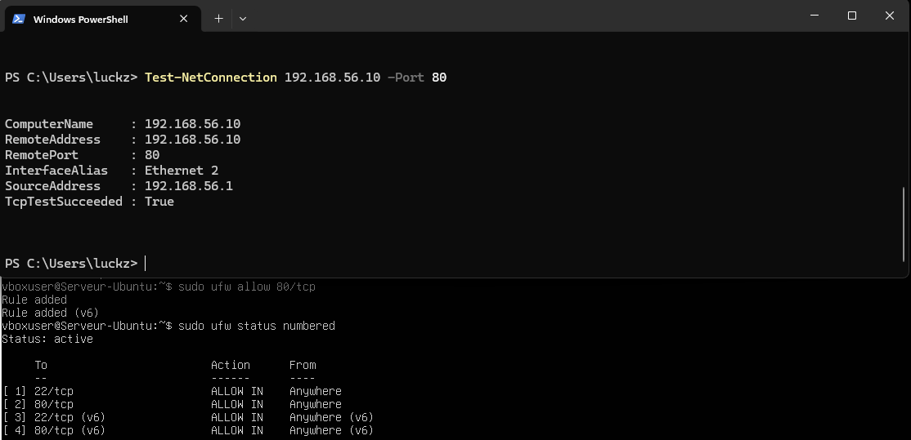

## Autorisation d’Apache uniquement sur le réseau privé hôte

L’accès à Apache a été limité à l’interface ou au réseau privé hôte.

Exemple de commande :

```bash
sudo ufw delete allow 'Apache'
sudo ufw allow in on enp0s8 to any port 80 proto tcp
```

L’interface `enp0s8` doit être remplacée par le nom réel de l’interface privée si celui-ci est différent.

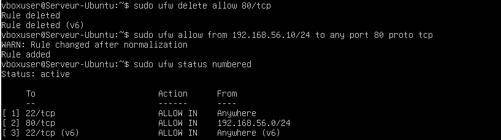

## Autorisation de SSH uniquement sur le réseau privé hôte

L’accès SSH a également été limité au réseau privé hôte.

Exemple de commande :

```bash
sudo ufw delete allow ssh
sudo ufw allow in on enp0s8 to any port 22 proto tcp
```

Cette règle limite l’accès SSH à l’interface réseau privée.

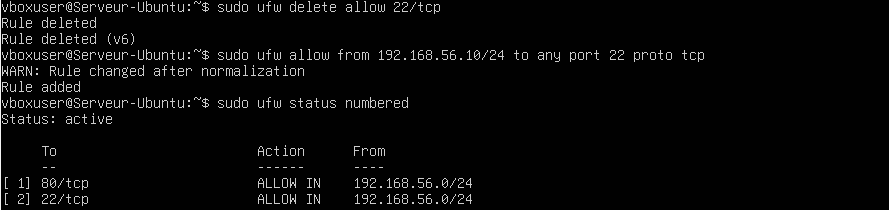

## Activation des journaux UFW

La journalisation du pare-feu a été activée afin d’enregistrer les connexions autorisées ou bloquées.

Commande utilisée :

```bash
sudo ufw logging on
```

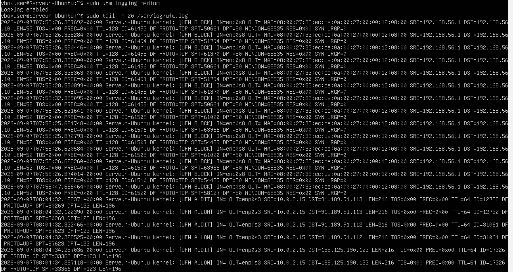

## Consultation des blocages UFW

Les journaux système ont été consultés afin d’identifier les paquets bloqués par UFW.

Commandes utilisées :

```bash
sudo journalctl -k | grep UFW
sudo grep UFW /var/log/ufw.log
```

Selon la configuration du système, le fichier `/var/log/ufw.log` peut ne pas être présent. Dans ce cas, `journalctl` permet de consulter les événements du noyau.

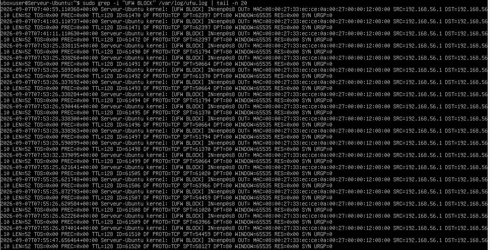

## Réinitialisation de la configuration UFW

La configuration a été remise à zéro afin de revenir à une configuration propre du pare-feu.

Commandes utilisées :

```bash
sudo ufw reset
sudo ufw status
```

La commande `ufw reset` supprime les règles personnalisées et désactive le pare-feu. Il faut donc vérifier l’état final avant de quitter le laboratoire.

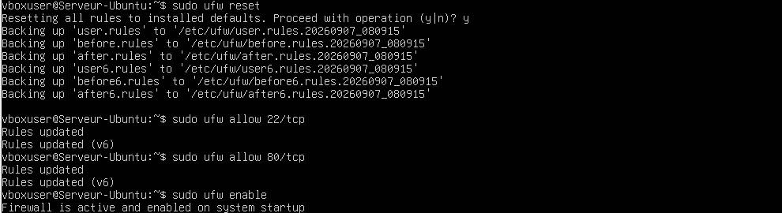

## Résultat

- L’état initial d’UFW a été vérifié.
- SSH et Apache ont été autorisés.
- Les politiques entrantes et sortantes ont été définies.
- Le pare-feu a été activé.
- Les connexions sortantes ont été testées.
- Les connexions entrantes ont été contrôlées depuis Windows.
- Le trafic HTTP a été bloqué puis réautorisé.
- Apache et SSH ont été limités au réseau privé hôte.
- Les journaux UFW ont été activés et consultés.
- La configuration finale a été réinitialisée.

## Compétences acquises

- Vérification de l’état d’un pare-feu Linux
- Création de règles UFW
- Gestion des politiques entrantes et sortantes
- Autorisation de services par nom
- Limitation d’accès à une interface réseau
- Contrôle des ports SSH et HTTP
- Activation et lecture des journaux UFW
- Réinitialisation d’une configuration de pare-feu
