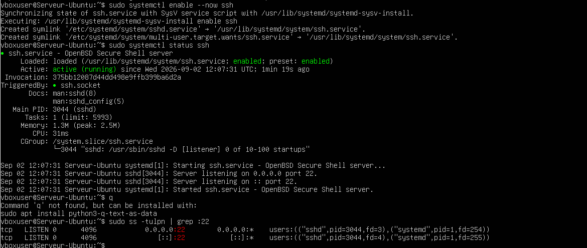
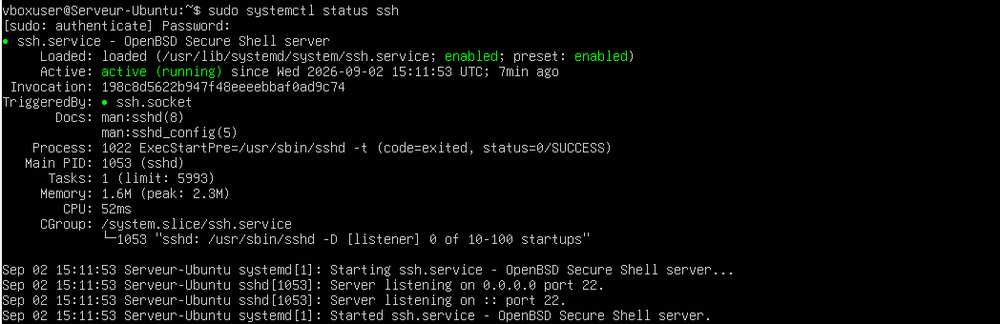
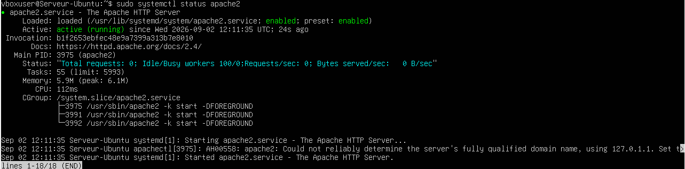
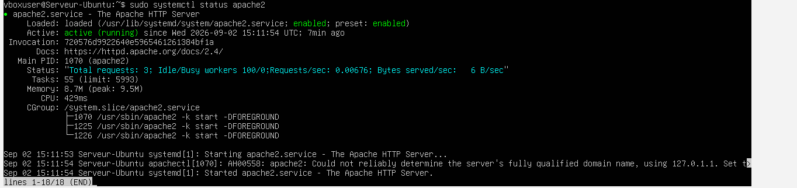
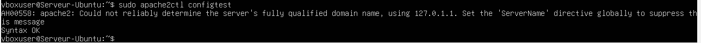

# Lab 02 — Gestion des services SSH et Apache

## Objectif

Installer, activer et vérifier les services SSH et Apache sur un serveur Ubuntu.

## Environnement

- Ubuntu Server
- VirtualBox
- Service SSH
- Apache2

## Vérification réseau

Avant de tester les services, l’adresse IP du serveur a été vérifiée.


## Configuration du service SSH

Le service SSH a été lancé puis configuré pour permettre l’administration distante du serveur.

Commandes utilisées :

```bash
sudo systemctl enable --now ssh
sudo systemctl status ssh
sudo ss -tulpn | grep :22
```



Le bon fonctionnement du service SSH a ensuite été contrôlé.



## Configuration du service Apache

Le serveur Apache a été lancé puis vérifié.

Commandes utilisées :

```bash
sudo systemctl start apache2
sudo systemctl status apache2
```



Une vérification complémentaire du service Apache a été réalisée.



## Activation automatique d’Apache

Le service Apache a été activé au démarrage du système.

Commande utilisée :

```bash
sudo systemctl enable apache2
sudo systemctl is-enabled apache2
```


## Vérification de la configuration Apache

Une vérification globale du système Apache a été effectuée.

Commande utilisée :

```bash
sudo apache2ctl configtest
```



## Modification de la page d’accueil

La page d’accueil par défaut d’Apache a été modifiée afin de personnaliser l’affichage du serveur web.

Une vérification locale a ensuite été réalisée avec :

```bash
curl http://localhost
```


## Résultat

- Le service SSH est actif.
- Le port 22 est à l’écoute.
- Le service Apache est installé et fonctionnel.
- Apache est activé au démarrage.
- La page d’accueil du serveur a été personnalisée.

## Compétences acquises

- Gestion d’un service avec `systemctl`
- Activation d’un service au démarrage
- Vérification d’écoute réseau avec `ss`
- Contrôle d’un serveur web Apache
- Test local avec `curl`
- Vérification d’une configuration Apache
