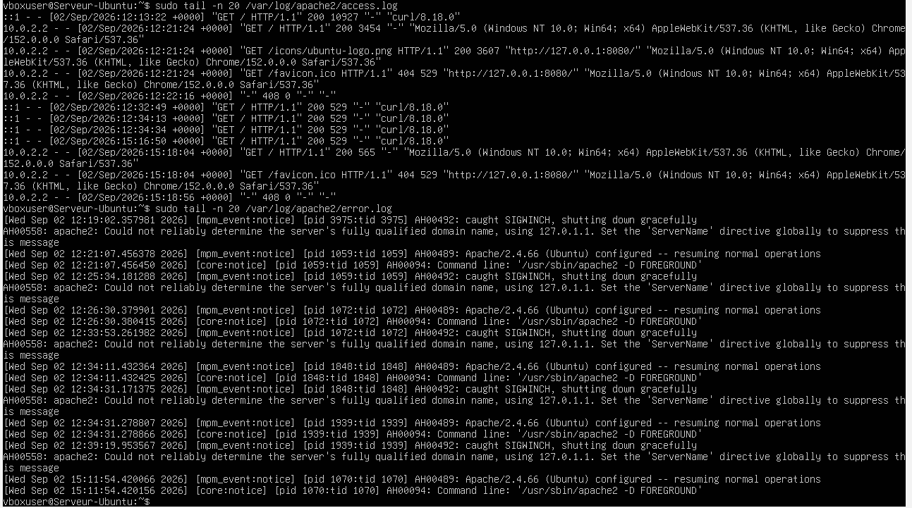
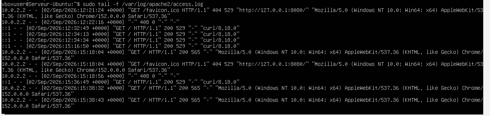
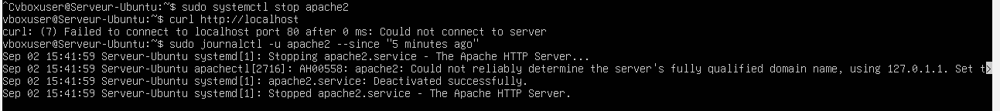
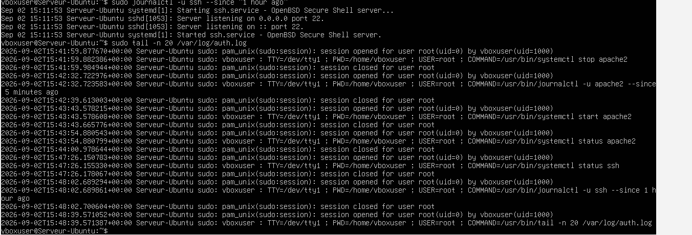
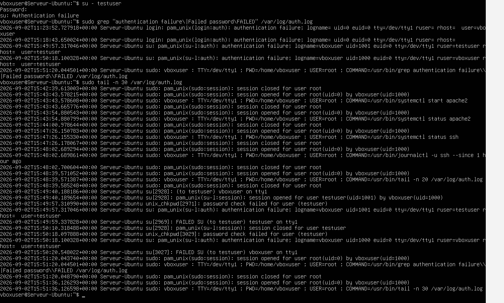

# Lab 03 — Analyse de journaux et diagnostic

## Objectif

Analyser les journaux système et applicatifs afin de diagnostiquer le fonctionnement des services Apache et SSH sur Ubuntu Server.

## Environnement

- Ubuntu Server
- VirtualBox
- Apache2
- SSH
- Journaux système Linux

## Vérification des journaux

Une première lecture des journaux a été réalisée afin d’identifier les événements récents liés au système et aux services.

Commandes utilisées :

```bash
sudo tail -n 20 /var/log/apache2/access.log
sudo tail -n 20 /var/log/apache2/error.log
```



## Requêtes en direct

Une surveillance en direct du journal d’accès Apache a été effectuée pendant l’ouverture de la page depuis un navigateur Windows.

Commande utilisée :

```bash
sudo tail -f /var/log/apache2/access.log
```

Cette vérification permet d’observer les requêtes HTTP générées par les clients.



## Diagnostic après arrêt du service Apache

Un test a été réalisé après l’arrêt du service Apache afin d’observer le comportement du système en cas d’indisponibilité.

Commandes utilisées :

```bash
sudo systemctl stop apache2
curl http://localhost
sudo journalctl -u apache2 --since "5 minutes ago"
```

Le message d’erreur confirme que le serveur web ne répond plus lorsque le service est arrêté.



## Lecture des logs SSH

Les journaux liés au service SSH et à l’authentification ont été consultés afin d’identifier les connexions et les actions administratives.

Commandes utilisées :

```bash
sudo journalctl -u ssh --since "1 hour ago"
sudo tail -n 20 /var/log/auth.log
```



## Simulation d’un échec de connexion

Une tentative de connexion échouée a été provoquée afin de vérifier son enregistrement dans les journaux d’authentification.

Commandes utilisées :

```bash
su - testuser
sudo grep "authentication failure\|Failed password\|FAILED" /var/log/auth.log
sudo tail -n 30 /var/log/auth.log
```

Les journaux affichent clairement les messages d’échec d’authentification, ce qui permet de repérer rapidement une tentative de connexion invalide.



## Résultat

- Les journaux Apache ont été consultés avec succès.
- Les requêtes HTTP peuvent être observées en direct.
- L’arrêt d’Apache produit une erreur identifiable dans les journaux.
- Les journaux SSH permettent de suivre les connexions et les actions administratives.
- Les échecs d’authentification sont visibles dans `/var/log/auth.log`.

## Compétences acquises

- Lecture des journaux Apache
- Analyse des logs système
- Utilisation de `tail` et `tail -f`
- Consultation de journaux avec `journalctl`
- Diagnostic d’un service arrêté
- Analyse des événements d’authentification SSH
