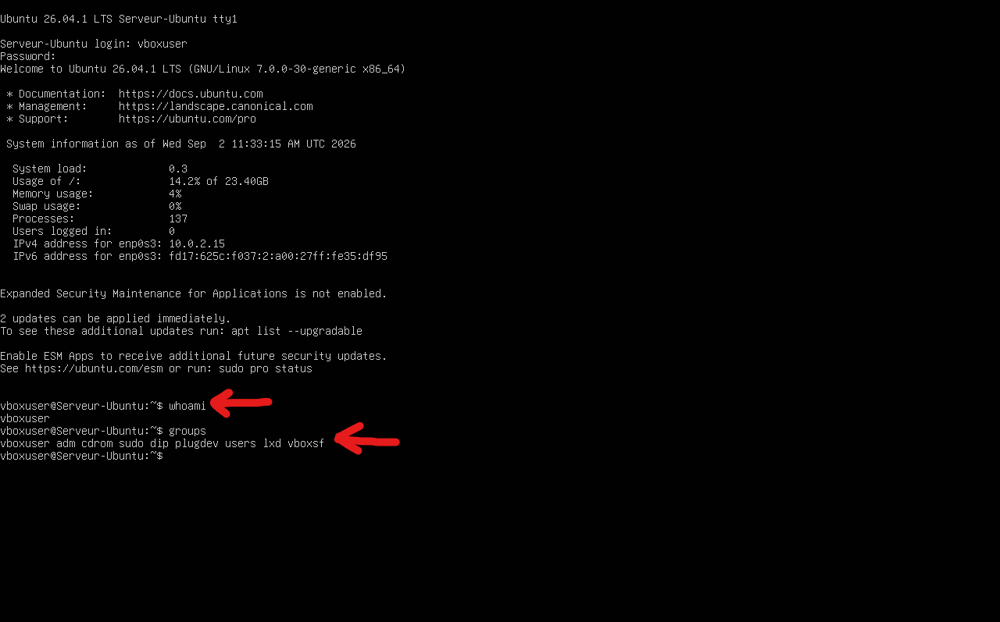
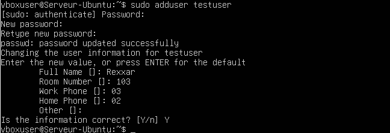
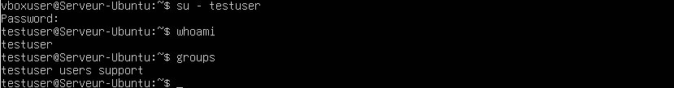

# Lab 04 — Gestion des utilisateurs, groupes et permissions

## Objectif

Créer un utilisateur, gérer un groupe, configurer un dossier partagé et vérifier les droits d’accès sous Ubuntu Server.

## Environnement

- Ubuntu Server
- VirtualBox
- Gestion des utilisateurs Linux
- Gestion des groupes Linux
- Permissions sur les fichiers et dossiers

## Vérification de la session et des droits

Une première vérification a été réalisée afin d’identifier l’utilisateur connecté et les groupes auxquels il appartient.

Commandes utilisées :

```bash
whoami
groups
```



## Création d’un utilisateur

Un nouvel utilisateur nommé `testuser` a été créé pour réaliser les tests de droits et d’accès.

Commande utilisée :

```bash
sudo adduser testuser
```



## Création d’un groupe

Un nouveau groupe nommé `support` a été créé.

Commandes utilisées :

```bash
sudo groupadd support
getent group support
```


## Ajout de l’utilisateur au groupe

L’utilisateur `testuser` a ensuite été ajouté au groupe `support`.

Commandes utilisées :

```bash
sudo usermod -aG support testuser
groups testuser
```


## Création du dossier partagé

Un dossier de travail a été créé dans le répertoire personnel afin de servir d’espace partagé.

Commandes utilisées :

```bash
mkdir ~/lab-partage
ls -ld ~/lab-partage
```


## Changement de groupe propriétaire

Le groupe propriétaire du dossier a été modifié avec `chown`.

Commandes utilisées :

```bash
sudo chown :support ~/lab-partage
ls -ld ~/lab-partage
```


## Modification des permissions

Les permissions du dossier ont été adaptées afin d’autoriser l’accès au propriétaire et au groupe.

Commandes utilisées :

```bash
chmod 770 ~/lab-partage
ls -ld ~/lab-partage
```


## Test d’écriture dans le dossier

Un premier fichier a été créé dans le dossier partagé afin de vérifier les droits d’écriture.

Commandes utilisées :

```bash
echo "Document de test du groupe support" > ~/lab-partage/document.txt
cat ~/lab-partage/document.txt
ls -l ~/lab-partage/document.txt
```


## Changement de compte utilisateur

Une connexion a ensuite été effectuée avec le compte `testuser` afin de vérifier son appartenance au groupe `support`.

Commandes utilisées :

```bash
su - testuser
whoami
groups
```



## Création d’un fichier avec un utilisateur standard

Depuis le compte `testuser`, un nouveau fichier a été créé dans le dossier partagé.

Commandes utilisées :

```bash
echo "Créé par testuser" > fichier-testuser.txt
ls -l
```


## Résultat

- Un utilisateur `testuser` a été créé.
- Un groupe `support` a été créé.
- L’utilisateur `testuser` a été ajouté au groupe.
- Un dossier partagé a été mis en place.
- Le groupe propriétaire et les permissions ont été configurés.
- Le compte `testuser` a pu écrire dans le dossier partagé.

## Compétences acquises

- Création d’un utilisateur avec `adduser`
- Création d’un groupe avec `groupadd`
- Ajout d’un utilisateur à un groupe avec `usermod`
- Consultation des groupes avec `groups`
- Gestion de propriétaire et groupe avec `chown`
- Modification des permissions avec `chmod`
- Vérification des accès sur un dossier partagé
