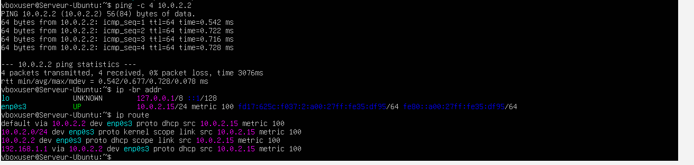
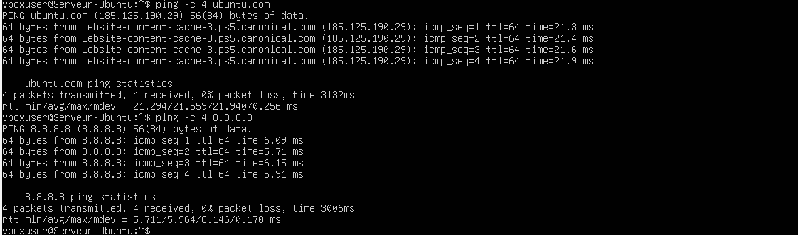
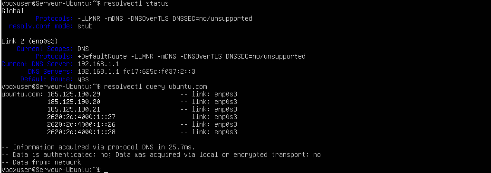
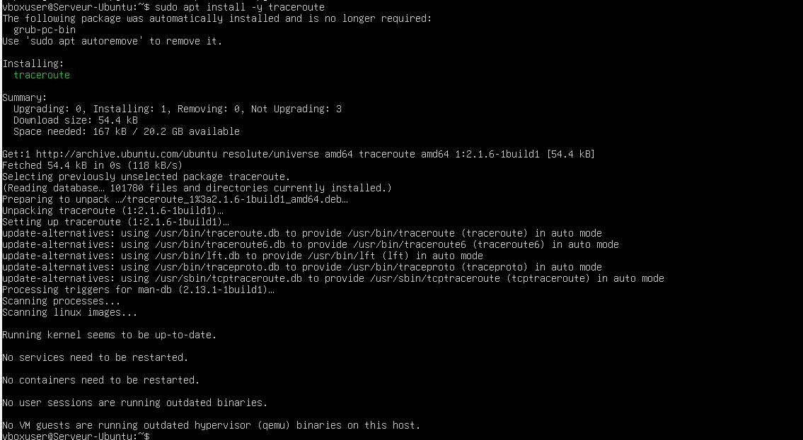
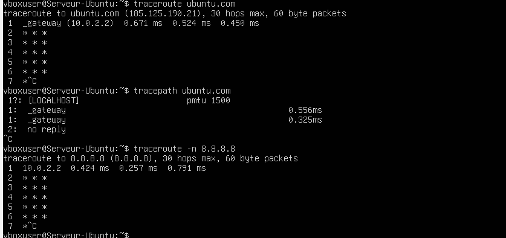
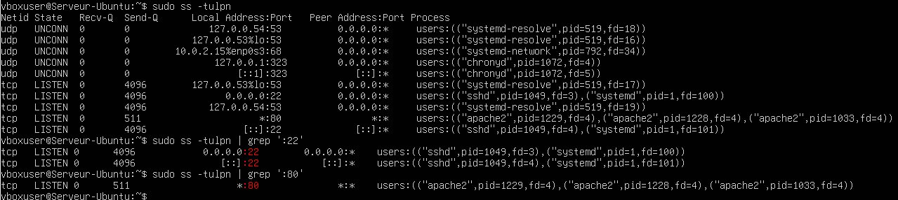
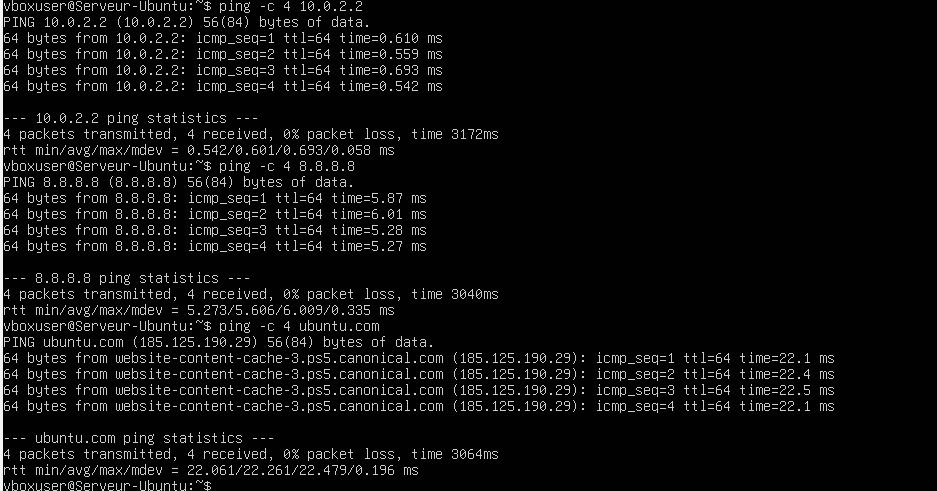
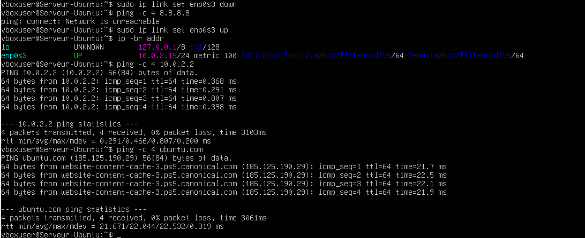

# Lab 05 — Diagnostic réseau Linux

## Objectif

Identifier l’interface réseau active, vérifier la connectivité, contrôler la résolution DNS et utiliser plusieurs outils de diagnostic réseau sous Ubuntu Server.

## Environnement

- Ubuntu Server
- VirtualBox
- Réseau NAT
- Outils réseau Linux
- Apache2
- SSH

## Identification de l’interface réseau

La première étape a consisté à identifier l’interface réseau active et l’adresse IP associée.

Commande utilisée :

```bash
ip -br addr
```


## Vérification de la passerelle

La connectivité avec la passerelle a été testée afin de vérifier le bon fonctionnement du réseau local.

Commandes utilisées :

```bash
ping -c 4 10.0.2.2
ip route
```



## Test de connectivité avec et sans DNS

Des tests ont été réalisés vers une adresse IP publique puis vers un nom de domaine afin de distinguer connectivité réseau et résolution DNS.

Commandes utilisées :

```bash
ping -c 4 8.8.8.8
ping -c 4 ubuntu.com
```



## Consultation de la configuration DNS

La configuration DNS active a été consultée à l’aide de `resolvectl`.

Commandes utilisées :

```bash
resolvectl status
resolvectl query ubuntu.com
```



## Installation de traceroute

L’outil `traceroute` a été installé afin d’analyser le chemin réseau vers une destination distante.

Commande utilisée :

```bash
sudo apt install -y traceroute
```



## Utilisation de traceroute

Des tests de cheminement ont été réalisés vers un nom de domaine et vers une adresse IP.

Commandes utilisées :

```bash
traceroute ubuntu.com
tracepath ubuntu.com
traceroute -n 8.8.8.8
```



## Vérification des services réseau

Les services SSH et Apache ont été contrôlés afin de vérifier l’écoute des ports 22 et 80.

Commandes utilisées :

```bash
sudo ss -tulpn
sudo ss -tulpn | grep :22
sudo ss -tulpn | grep :80
```



## Test d’Apache en local et sur l’adresse réseau

Le service Apache a été testé à la fois via l’interface locale et via l’adresse IP du serveur.

Commandes utilisées :

```bash
curl http://localhost
curl http://10.0.2.15
```


## Observation des voisins réseau

Les voisins réseau détectés ont été consultés.

Commande utilisée :

```bash
ip neigh
```


## Validation globale du réseau

Une série de tests a confirmé le bon fonctionnement global du réseau.

Commandes utilisées :

```bash
ping -c 4 10.0.2.2
ping -c 4 8.8.8.8
ping -c 4 ubuntu.com
```



## Diagnostic avec désactivation puis réactivation de l’interface

Un test complémentaire a été réalisé en désactivant temporairement l’interface réseau puis en la réactivant.

Commandes utilisées :

```bash
sudo ip link set enp0s3 down
ping -c 4 8.8.8.8
sudo ip link set enp0s3 up
ip -br addr
ping -c 4 10.0.2.2
ping -c 4 ubuntu.com
```

Ce test permet de vérifier la réaction du système face à une perte temporaire de connectivité.



## Résultat

- L’interface réseau active a été identifiée.
- La passerelle est joignable.
- La connectivité IP et la résolution DNS fonctionnent.
- La configuration DNS a été vérifiée.
- `traceroute` a été installé et utilisé avec succès.
- Les services SSH et Apache écoutent sur les ports attendus.
- Le serveur web Apache répond en local et sur l’adresse réseau.
- Le réseau reste fonctionnel après réactivation de l’interface.

## Compétences acquises

- Identification d’une interface réseau avec `ip`
- Vérification d’une route avec `ip route`
- Test de connectivité avec `ping`
- Vérification de la résolution DNS avec `resolvectl`
- Installation d’un outil avec `apt`
- Analyse de chemin réseau avec `traceroute`
- Vérification des ports en écoute avec `ss`
- Observation des voisins réseau avec `ip neigh`
- Diagnostic d’un incident réseau simple
