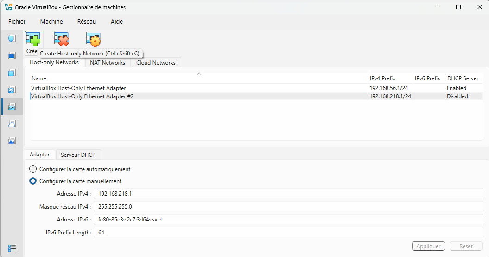
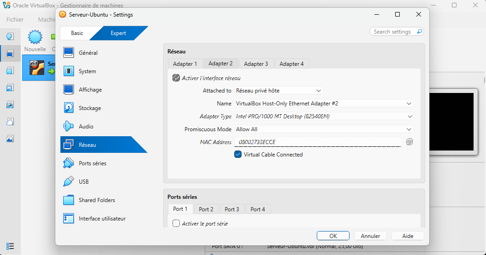
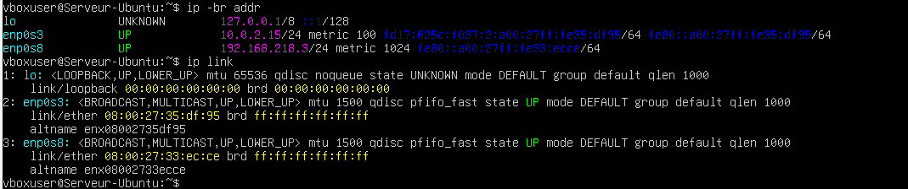
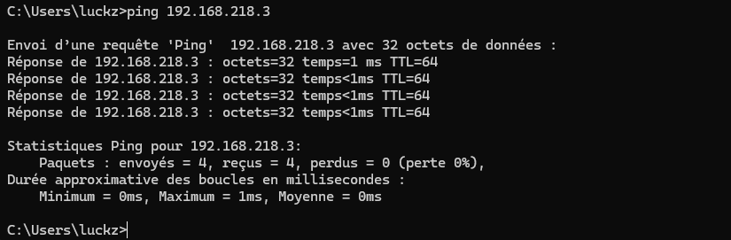
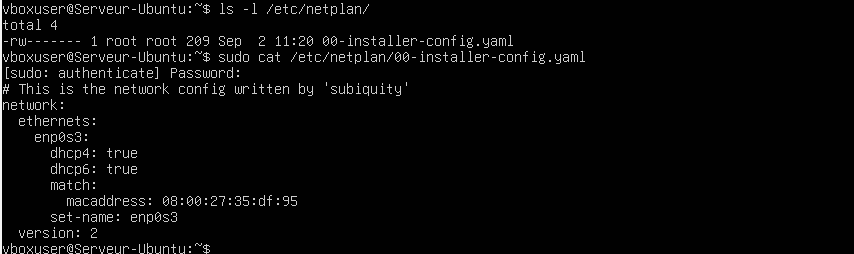
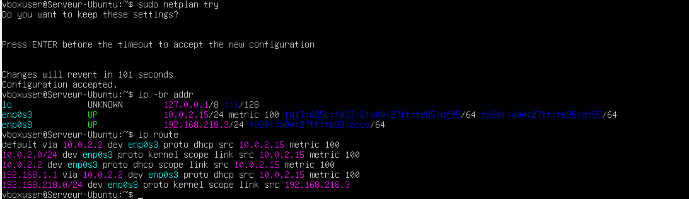
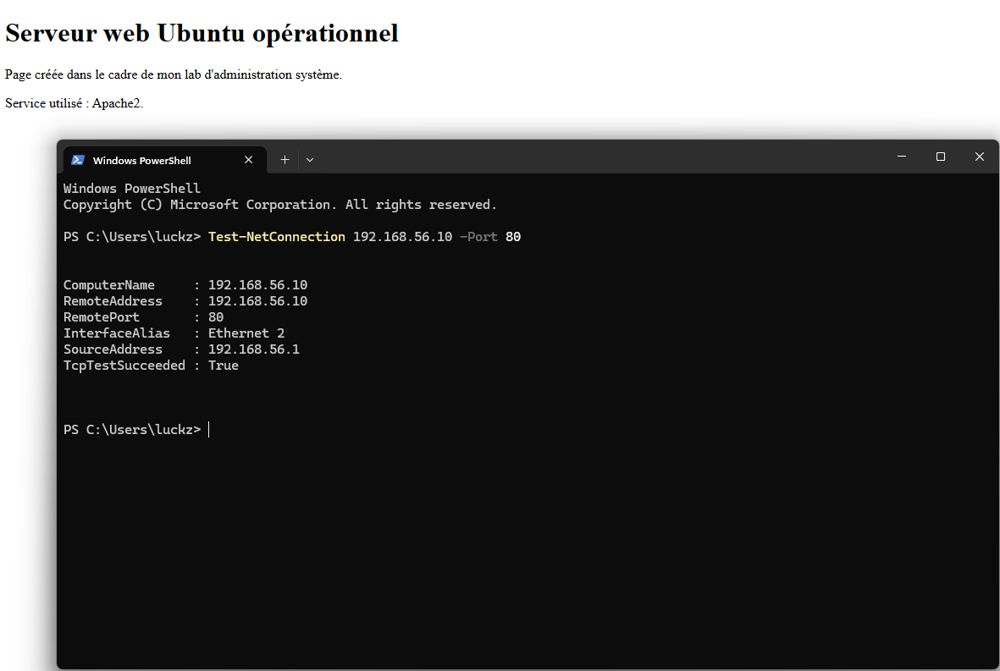
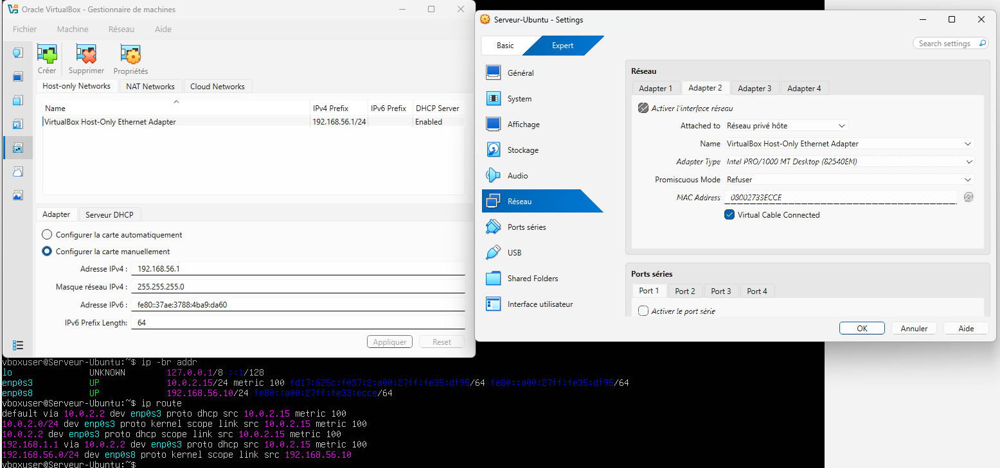

# Lab 06 — Réseau privé et adresse IP statique

## Objectif

Mettre en place un réseau privé de type Host-Only dans VirtualBox, ajouter une seconde interface réseau à Ubuntu Server, puis configurer une adresse IP statique avec Netplan afin de permettre la communication entre l’hôte Windows et la machine virtuelle Ubuntu.

## Environnement

- Ubuntu Server
- Windows
- VirtualBox
- Réseau Host-Only
- Netplan
- Apache2

## Création d’un réseau Host-Only

Un réseau privé hôte a été créé dans VirtualBox afin d’établir une communication directe entre l’ordinateur hôte et la machine virtuelle.



## Ajout de l’adaptateur réseau à Ubuntu

Un second adaptateur réseau a été ajouté à la machine virtuelle Ubuntu et rattaché au réseau Host-Only créé précédemment.



## Identification de la nouvelle interface

La nouvelle interface réseau a été identifiée depuis Ubuntu afin de vérifier son état et son adresse IP.

Commandes utilisées :

```bash
ip -br addr
ip link
```



## Test de l’adresse depuis Ubuntu

Un test de connectivité a été effectué depuis Ubuntu vers l’adresse IP du réseau privé.

Commande utilisée :

```bash
ping -c 4 192.168.218.3
```


## Test de l’adresse depuis Windows PowerShell

Depuis Windows, un contrôle de connectivité TCP a été réalisé vers le serveur Ubuntu sur le port 80 afin de vérifier l’accessibilité du service Apache. PowerShell fournit `Test-NetConnection` pour tester la joignabilité d’un hôte et d’un port depuis Windows. [web:590]

Commande utilisée :

```powershell
Test-NetConnection 192.168.56.10 -Port 80
```



## Vérification de la configuration Netplan

Le contenu du répertoire Netplan et le fichier de configuration existant ont été consultés avant modification. Netplan est l’outil standard de configuration réseau sur Ubuntu Server. [web:581]

Commandes utilisées :

```bash
ls -l /etc/netplan/
sudo cat /etc/netplan/00-installer-config.yaml
```



## Modification du fichier Netplan

Le fichier de configuration a été modifié afin d’attribuer une adresse IP statique à la nouvelle interface réseau.

Commandes utilisées :

```bash
sudo nano /etc/netplan/00-installer-config.yaml
sudo netplan generate
```


## Test de Netplan et vérification de la route Internet

La nouvelle configuration réseau a été testée avec Netplan puis les adresses et routes ont été vérifiées. Les commandes `ip addr` et `ip route` font partie des outils standard de diagnostic réseau sous Linux. [web:583][web:589]

Commandes utilisées :

```bash
sudo netplan try
ip -br addr
ip route
```



## Test de connexion depuis Windows

Une vérification complémentaire a été réalisée depuis Windows en envoyant des requêtes ICMP vers l’adresse IP statique de la machine Ubuntu.

Commande utilisée :

```powershell
ping 192.168.218.3
```



## Validation de la configuration réseau privée

Un dernier contrôle a confirmé que l’interface Host-Only est active, configurée correctement et joignable depuis Ubuntu.

Commandes utilisées :

```bash
ip -br addr
ip route
ping -c 4 192.168.218.3
```



## Résultat

- Un réseau Host-Only a été créé dans VirtualBox.
- Une seconde interface réseau a été ajoutée à Ubuntu.
- Une adresse IP statique a été configurée avec Netplan.
- La machine Ubuntu est joignable depuis Windows.
- La connectivité locale entre l’hôte et la machine virtuelle est fonctionnelle.
- La configuration réseau principale et la route Internet ont été conservées.

## Compétences acquises

- Création d’un réseau Host-Only dans VirtualBox
- Ajout d’une interface réseau à une machine virtuelle
- Identification d’interfaces réseau avec `ip`
- Lecture et modification d’une configuration Netplan
- Attribution d’une adresse IP statique
- Validation d’une configuration avec `netplan try`
- Vérification de la table de routage
- Test de connectivité entre Windows et Ubuntu
