# Lab 08 — Mises à jour, audit système et auditd

## Objectif

Identifier le système Ubuntu, rechercher et installer les mises à jour disponibles, vérifier les mécanismes de mise à jour automatique et mettre en place une surveillance élémentaire avec auditd.

## Environnement

- Ubuntu Server
- APT
- Unattended-upgrades
- systemd
- auditd
- aureport

## Identification du système

Les informations générales du système ont été relevées afin d’identifier la distribution, sa version et la version du noyau.

Commandes utilisées :

```bash
cat /etc/os-release
uname -a
hostnamectl
```

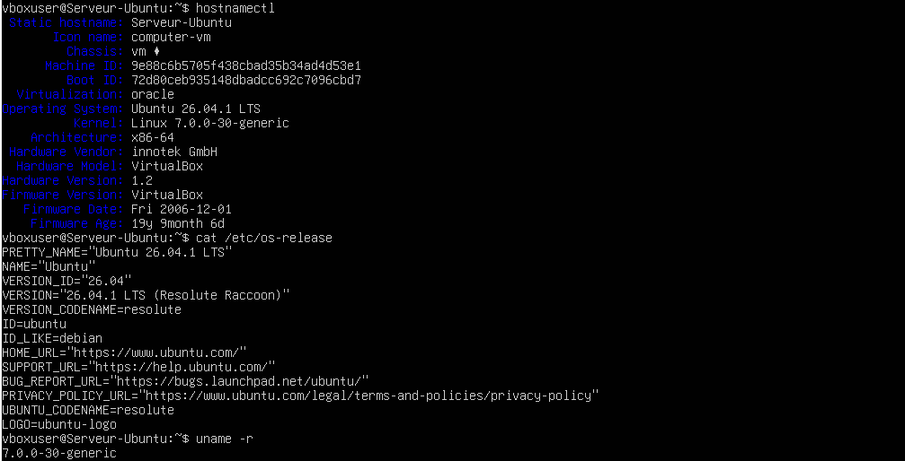

## Liste des mises à jour disponibles

La liste des paquets pouvant être mis à jour a été actualisée puis consultée.

Commandes utilisées :

```bash
sudo apt update
apt list --upgradable
```

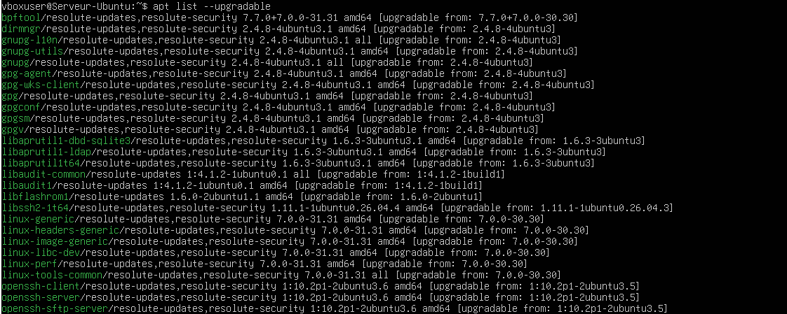

## Installation des mises à jour

Les mises à jour disponibles ont été installées avec APT.

Commandes utilisées :

```bash
sudo apt upgrade
```

ou, si nécessaire :

```bash
sudo apt full-upgrade
```

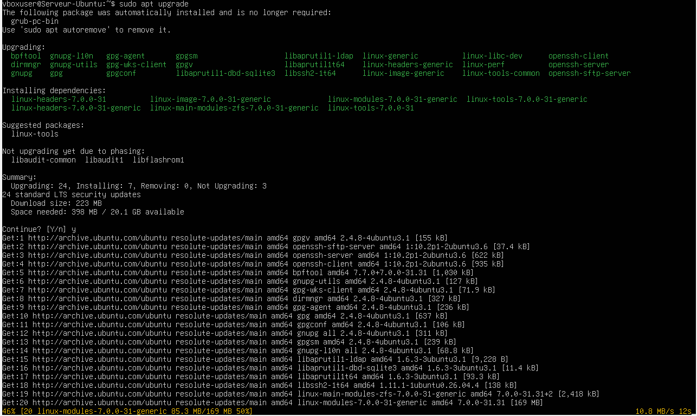

## Vérification d’un redémarrage nécessaire

Après l’installation, la présence du fichier indiquant qu’un redémarrage est nécessaire a été vérifiée.

Commande utilisée :

```bash
if [ -f /var/run/reboot-required ]; then
    echo "Redémarrage nécessaire"
else
    echo "Aucun redémarrage nécessaire"
fi
```

Une vérification complémentaire peut être effectuée avec :

```bash
sudo needrestart
```

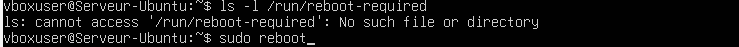

## Vérification des mises à jour automatiques

Le fonctionnement du service de mises à jour automatiques a été contrôlé.

Commandes utilisées :

```bash
systemctl status unattended-upgrades
systemctl status apt-daily.timer
systemctl status apt-daily-upgrade.timer
```

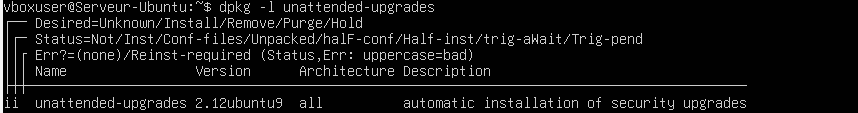

## Journal des mises à jour automatiques

Les journaux liés aux mises à jour automatiques ont été consultés.

Commandes utilisées :

```bash
sudo journalctl -u unattended-upgrades
sudo journalctl -u apt-daily-upgrade.service
```

Les journaux permettent de vérifier les exécutions du service et les opérations réalisées.

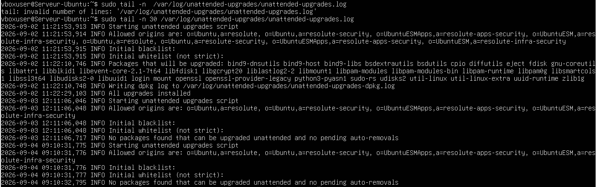

## Événements liés au service

Les événements récents liés aux services de mise à jour ont été recherchés dans le journal systemd.

Commandes utilisées :

```bash
sudo journalctl --since "24 hours ago" | grep -Ei "apt|upgrade|unattended"
```

Une vérification de l’état des services a également été effectuée :

```bash
systemctl list-timers --all | grep apt
```

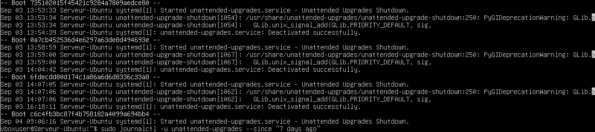

## Historique APT

L’historique des installations, suppressions et mises à jour de paquets a été consulté.

Commandes utilisées :

```bash
less /var/log/apt/history.log
less /var/log/apt/term.log
```

Une recherche ciblée peut être effectuée avec :

```bash
grep -Ei "upgrade|install|remove" /var/log/apt/history.log
```

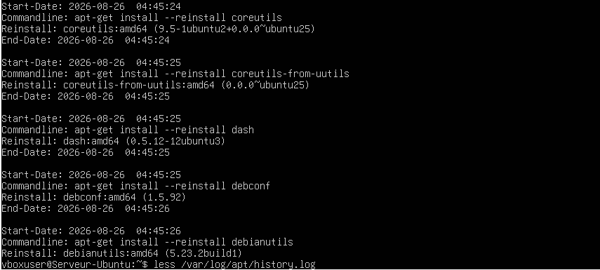

## Vérification du service auditd

Le service auditd a été contrôlé afin de vérifier s’il est actif et configuré pour démarrer automatiquement.

Commandes utilisées :

```bash
sudo systemctl status auditd
sudo systemctl is-enabled auditd
sudo systemctl is-active auditd
```

Si le service n’est pas installé :

```bash
sudo apt install auditd audispd-plugins
```

Pour l’activer au démarrage :

```bash
sudo systemctl enable auditd
```

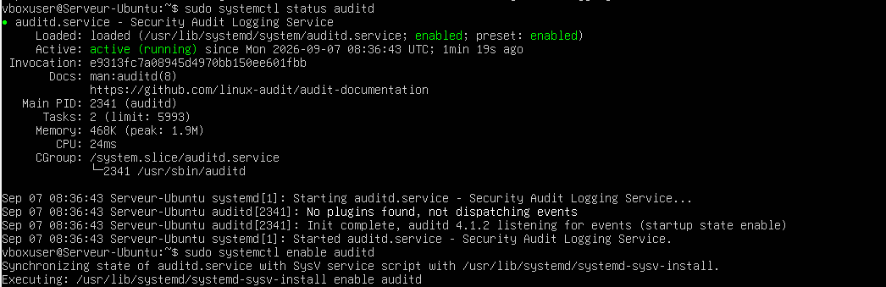

## Signification d’une règle d’audit

Une règle d’audit décrit l’événement ou le fichier à surveiller ainsi que les informations à enregistrer.

Exemple :

```bash
-w /etc/passwd -p wa -k identite
```

Signification :

- `-w /etc/passwd` : surveille le fichier `/etc/passwd`.
- `-p wa` : surveille les opérations d’écriture et les changements d’attributs.
- `-k identite` : associe l’événement à la clé de recherche `identite`.

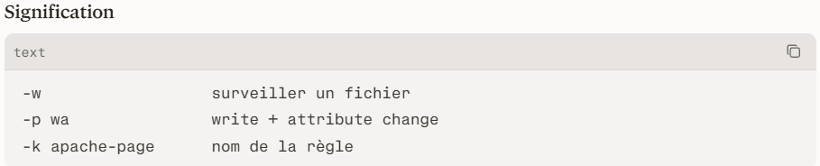

## Mise en place d’une règle d’audit temporaire

Une règle de surveillance temporaire a été ajoutée afin de détecter les modifications du fichier `/etc/passwd`.

Commande utilisée :

```bash
sudo auditctl -w /etc/passwd -p wa -k identite
```

La présence de la règle a été vérifiée avec :

```bash
sudo auditctl -l
```

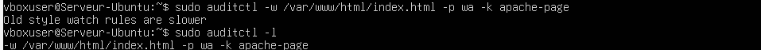

## Recherche d’un événement

Une modification contrôlée a été effectuée afin de générer un événement d’audit, puis l’événement a été recherché avec sa clé.

Commandes utilisées :

```bash
sudo ausearch -k identite
sudo ausearch -f /etc/passwd
```

Pour afficher les événements dans un format plus lisible :

```bash
sudo ausearch -k identite -i
```

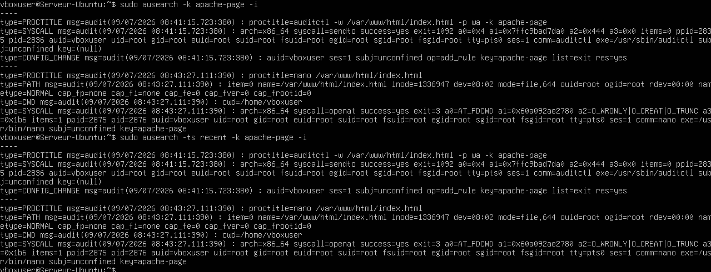

## Consultation du rapport aureport

Le rapport synthétique fourni par aureport a été consulté afin d’obtenir une vue globale des événements enregistrés.

Commandes utilisées :

```bash
sudo aureport
sudo aureport -au
sudo aureport -f
```

Exemples de rapports :

- `aureport` : rapport général.
- `aureport -au` : événements d’authentification.
- `aureport -f` : événements liés aux fichiers.

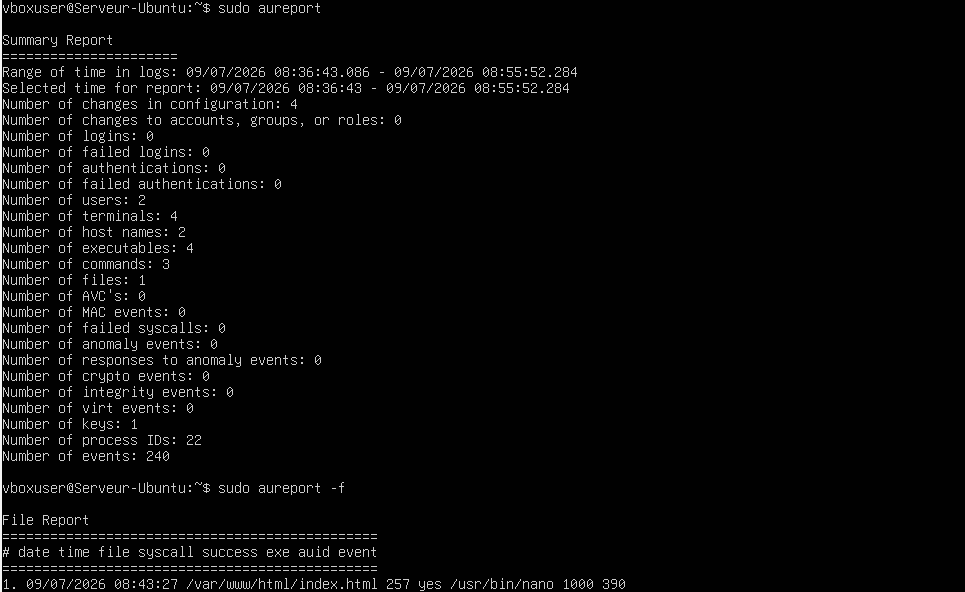

## Écriture de la règle persistante

La règle a été écrite dans un fichier dédié afin d’être rechargée automatiquement après un redémarrage.

Fichier utilisé :

```bash
/etc/audit/rules.d/identite.rules
```

Contenu :

```text
-w /etc/passwd -p wa -k identite
```

Commande utilisée :

```bash
echo "-w /etc/passwd -p wa -k identite" | sudo tee /etc/audit/rules.d/identite.rules
```

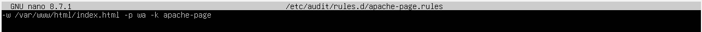

## Application de la règle persistante

La règle persistante a été chargée et contrôlée.

Commandes utilisées :

```bash
sudo augenrules --load
sudo auditctl -l
```

Selon la configuration du système, le service peut également être redémarré :

```bash
sudo systemctl restart auditd
```

La règle est maintenant conservée dans la configuration auditd et pourra être rechargée au démarrage.

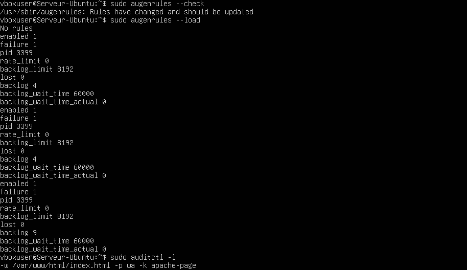

## Résultat

- Le système Ubuntu a été identifié.
- Les mises à jour disponibles ont été listées.
- Les paquets ont été mis à jour.
- La nécessité d’un redémarrage a été vérifiée.
- Les mises à jour automatiques ont été contrôlées.
- Les journaux des services et l’historique APT ont été consultés.
- Le service auditd a été vérifié.
- Une règle de surveillance du fichier `/etc/passwd` a été créée.
- Un événement d’audit a été recherché.
- Les rapports aureport ont été consultés.
- La règle a été rendue persistante et appliquée.

## Compétences acquises

- Identification d’un système Linux
- Gestion des mises à jour avec APT
- Vérification des services systemd
- Lecture des journaux système
- Consultation de l’historique APT
- Utilisation d’auditd
- Création de règles d’audit
- Recherche d’événements avec ausearch
- Génération de rapports avec aureport
- Mise en place de règles persistantes
