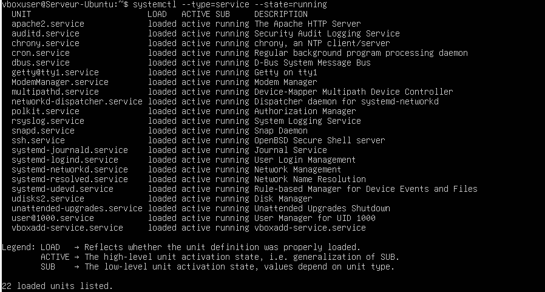
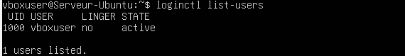
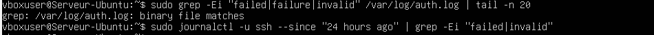
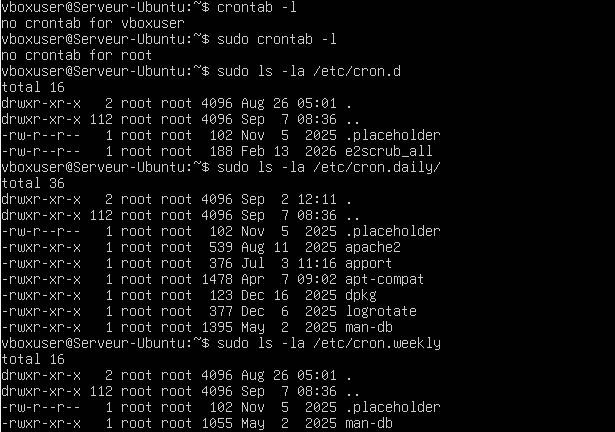
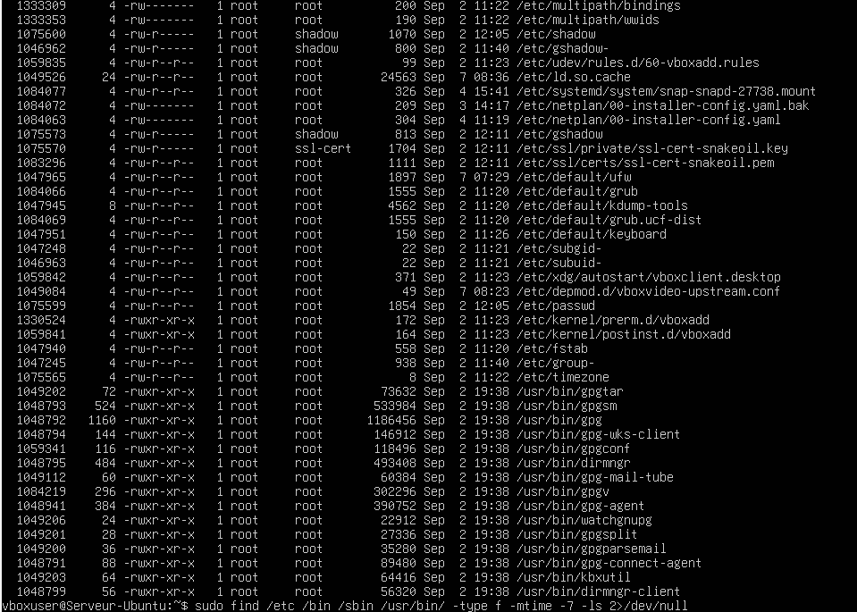
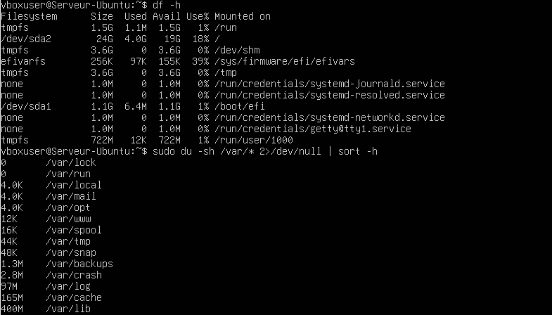
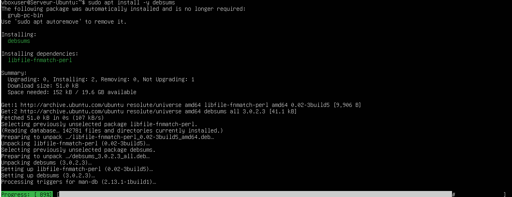
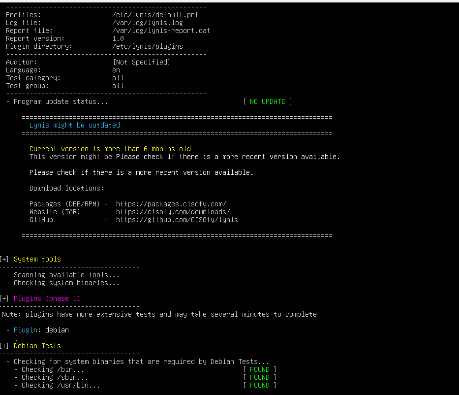
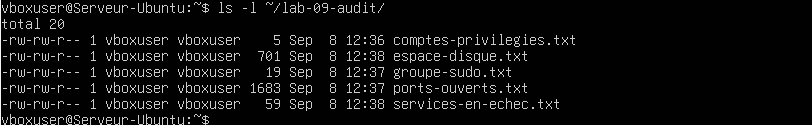

# Lab 09 — Audit de sécurité du système Ubuntu

## Objectif

Réaliser un audit de sécurité de base sur un serveur Ubuntu.

L’audit porte notamment sur :

- l’identification des comptes privilégiés ;
- les utilisateurs appartenant au groupe `sudo` ;
- les fichiers possédant les bits SUID et SGID ;
- les fichiers accessibles en écriture par tous ;
- les comptes ne possédant pas de mot de passe ;
- les ports ouverts ;
- les services actifs ;
- les utilisateurs connectés ;
- les échecs d’authentification ;
- les tâches planifiées ;
- les fichiers récemment modifiés ;
- l’espace disque ;
- l’intégrité des paquets ;
- l’audit global avec Lynis ;
- la création d’un rapport regroupant les résultats.

## Environnement

- Ubuntu Server
- VirtualBox
- APT
- systemd
- SSH
- Apache2
- UFW
- auditd
- debsums
- Lynis

## Organisation des captures

Les captures du laboratoire sont stockées dans le dossier `captures/`.

```text
captures/
├── affichage-privileges-utilisateurs.png
├── verification-acces-et-ports-ouverts.png
├── services-actifs.png
├── liste-utilisateurs.png
├── recherche-echecs-authentification.png
├── taches-planifiees.png
├── modifications-fichiers.png
├── verification-espace-disque.png
├── verification-integrite-paquets.png
├── audit-lynis.png
└── elements-rapport-final.png
```

# 1. Identification du système

Les informations générales du système ont été consultées afin d’identifier la distribution Ubuntu, sa version, le nom de la machine et la version du noyau.

Commandes utilisées :

```bash
cat /etc/os-release
hostnamectl
uname -a
```

Informations pouvant être relevées :

- nom de la distribution ;
- version d’Ubuntu ;
- nom de la machine ;
- version du noyau Linux ;
- architecture du système.

Cette première étape permet de connaître précisément l’environnement audité.

# 2. Identification des comptes privilégiés

Les comptes possédant l’UID `0` ont été recherchés.

Commande utilisée :

```bash
getent passwd | awk -F: '$3 == 0 {print $1}'
```

Sur une installation normale, le compte `root` est généralement le seul compte possédant l’UID `0`.

Une recherche complémentaire des utilisateurs autorisés à utiliser `sudo` a été effectuée :

```bash
getent group sudo
```

Les droits sudo de l’utilisateur principal peuvent être vérifiés avec :

```bash
sudo -l -U vboxuser
```

Cette étape permet d’identifier les utilisateurs disposant de privilèges administratifs.


# 3. Recherche des fichiers SUID et SGID

Les fichiers possédant les bits SUID et SGID ont été recherchés.

Ces permissions permettent à un programme de s’exécuter avec les droits de son propriétaire ou de son groupe. Elles sont parfois nécessaires au fonctionnement du système, mais doivent être identifiées car elles peuvent représenter un risque si elles sont appliquées à un fichier inattendu.

Commandes utilisées :

```bash
sudo find / -xdev -type f -perm -4000 -ls 2>/dev/null
```

Recherche des fichiers SGID :

```bash
sudo find / -xdev -type f -perm -2000 -ls 2>/dev/null
```

Recherche combinée :

```bash
sudo find / -xdev -type f -perm /6000 -ls 2>/dev/null
```

Les résultats doivent être documentés avant toute modification.

# 4. Recherche des fichiers accessibles en écriture par tous

Les fichiers système accessibles en écriture par tous les utilisateurs ont été recherchés.

Commande utilisée :

```bash
sudo find /etc /bin /sbin /usr -type f -perm -002 -ls 2>/dev/null
```

Une recherche plus large peut être exécutée avec :

```bash
sudo find / -xdev -type f -perm -0002 2>/dev/null
```

Un fichier modifiable par tous les utilisateurs doit être analysé avant toute correction. Il ne faut pas modifier automatiquement les résultats, car certains fichiers peuvent être nécessaires au fonctionnement d’un service.

# 5. Vérification des mots de passe vides

Les comptes ne possédant pas de mot de passe ont été recherchés dans `/etc/shadow`.

Commande utilisée :

```bash
sudo awk -F: '($2 == "") {print $1}' /etc/shadow
```

La consultation de `/etc/shadow` nécessite les privilèges administrateur car ce fichier contient les informations sensibles liées aux mots de passe.

Une sortie vide indique qu’aucun compte ne possède de champ de mot de passe vide.

# 6. Vérification des accès et des ports ouverts

Les ports TCP et UDP en écoute ont été listés afin d’identifier les services accessibles sur le serveur.

Commande utilisée :

```bash
sudo ss -tulpn
```

Les ports SSH et HTTP peuvent être recherchés avec :

```bash
sudo ss -tulpn | grep -E ':22|:80'
```

Les principaux ports contrôlés sont :

- port `22` : service SSH ;
- port `80` : service HTTP Apache ;
- autres ports éventuellement ouverts par des services installés.

Les services exposés doivent être justifiés et protégés par le pare-feu lorsque cela est nécessaire.


# 7. Vérification des services actifs

Les services actuellement actifs ont été listés.

Commande utilisée :

```bash
systemctl --type=service --state=running
```

Les services en échec ont également été recherchés :

```bash
systemctl --failed
```

Une vérification ciblée peut être effectuée pour SSH et Apache :

```bash
systemctl status ssh
systemctl status apache2
```

Cette étape permet de repérer les services actifs, les services arrêtés et les services présentant une erreur.



# 8. Consultation des utilisateurs connectés

Les sessions ouvertes sur la machine ont été vérifiées avec plusieurs commandes.

Commandes utilisées :

```bash
who
w
users
```

Lorsque les commandes traditionnelles ne retournent pas d’information, les sessions gérées par systemd peuvent être consultées avec :

```bash
loginctl list-sessions
loginctl list-users
```

L’historique des dernières connexions a été affiché avec :

```bash
last -n 10
```

La commande suivante permet également de vérifier l’identifiant de session courant :

```bash
echo "$XDG_SESSION_ID"
```

Sur certaines installations Ubuntu, `who`, `w` et `users` peuvent afficher peu ou pas d’informations lorsque la base UTMP n’est pas alimentée de la manière attendue. Dans ce cas, `loginctl` constitue une méthode complémentaire pour consulter les sessions.



# 9. Recherche des échecs d’authentification

Les journaux d’authentification ont été consultés afin de rechercher les tentatives de connexion échouées.

Commande utilisée :

```bash
sudo grep -Ei "failed|failure|invalid" /var/log/auth.log | tail -n 20
```

Les événements liés au service SSH peuvent être consultés avec :

```bash
sudo journalctl -u ssh --since "24 hours ago"
```

Pour filtrer uniquement les erreurs :

```bash
sudo journalctl -u ssh --since "24 hours ago" | grep -Ei "failed|invalid|failure"
```

Les événements sudo peuvent également être recherchés :

```bash
sudo grep "sudo:" /var/log/auth.log | tail -n 20
```

Cette analyse permet d’identifier les échecs de connexion, les utilisateurs invalides et les tentatives d’accès refusées.



# 10. Vérification des tâches planifiées

Les tâches planifiées de l’utilisateur courant, de `root` et du système ont été vérifiées.

Crontab de l’utilisateur courant :

```bash
crontab -l
```

Crontab de root :

```bash
sudo crontab -l
```

Répertoires de tâches planifiées :

```bash
sudo ls -la /etc/cron.d/
sudo ls -la /etc/cron.hourly/
sudo ls -la /etc/cron.daily/
sudo ls -la /etc/cron.weekly/
sudo ls -la /etc/cron.monthly/
```

Le fichier cron principal peut être consulté avec :

```bash
sudo cat /etc/crontab
```

Les tâches planifiées doivent être vérifiées afin de distinguer les tâches légitimes des scripts inconnus ou inattendus.



# 11. Recherche des fichiers récemment modifiés

Les fichiers récemment modifiés dans les répertoires système ont été recherchés.

Commande utilisée :

```bash
sudo find /etc /bin /sbin /usr/bin -type f -mtime -7 -ls 2>/dev/null
```

Une recherche ciblée dans `/etc` peut également être effectuée :

```bash
sudo find /etc -type f -mtime -7 -ls 2>/dev/null
```

Cette commande identifie les fichiers modifiés au cours des sept derniers jours.

Les résultats doivent être interprétés avec prudence, car les mises à jour système peuvent modifier légitimement un grand nombre de fichiers.



# 12. Vérification de l’espace disque

L’espace disponible sur les systèmes de fichiers a été vérifié.

Commande utilisée :

```bash
df -h
```

Les répertoires volumineux du dossier `/var` ont été recherchés :

```bash
sudo du -sh /var/* 2>/dev/null | sort -h
```

Une recherche des plus gros éléments peut également être effectuée :

```bash
sudo du -ah /var 2>/dev/null | sort -h | tail -n 20
```

Cette vérification permet d’identifier :

- une partition presque pleine ;
- des journaux trop volumineux ;
- des fichiers temporaires importants ;
- une consommation inhabituelle d’espace disque.



# 13. Vérification de l’intégrité des paquets

L’outil `debsums` a été utilisé pour comparer les fichiers installés avec les sommes de contrôle enregistrées par les paquets Debian.

Installation de l’outil :

```bash
sudo apt update
sudo apt install -y debsums
```

Vérification des fichiers modifiés :

```bash
sudo debsums -c
```

Une sortie vide indique généralement qu’aucune différence n’a été détectée pour les fichiers contrôlés.

Une vérification plus complète peut être lancée avec :

```bash
sudo debsums -as
```

Les résultats doivent être analysés avant de conclure qu’un fichier est malveillant, car un fichier peut avoir été modifié légitimement après l’installation du paquet.



# 14. Audit global avec Lynis

L’outil Lynis a été installé afin de réaliser un audit global de sécurité du système.

Installation :

```bash
sudo apt update
sudo apt install -y lynis
```

Lancement de l’audit :

```bash
sudo lynis audit system
```

Les avertissements et suggestions peuvent être filtrés avec :

```bash
sudo lynis audit system 2>/dev/null | grep -Ei "warning|suggestion"
```

Un rapport peut être enregistré dans un fichier :

```bash
sudo lynis audit system 2>&1 | tee ~/lynis-rapport.txt
```

Lynis analyse notamment :

- la configuration du système ;
- les utilisateurs et l’authentification ;
- les permissions de fichiers ;
- les services ;
- le réseau ;
- le pare-feu ;
- les journaux ;
- les mécanismes d’audit ;
- certains paramètres de durcissement.

Le résultat de Lynis doit être interprété comme une liste de recommandations. Toutes les suggestions ne sont pas obligatoires dans un environnement de laboratoire.



# 15. Création du rapport final

Un répertoire de travail a été créé afin de conserver les résultats de l’audit.

Création du répertoire :

```bash
mkdir -p ~/lab-09-audit
```

Enregistrement des comptes privilégiés :

```bash
getent passwd | awk -F: '$3 == 0 {print $1}' \
    | tee ~/lab-09-audit/comptes-privilegies.txt
```

Enregistrement des membres du groupe sudo :

```bash
getent group sudo \
    | tee ~/lab-09-audit/groupe-sudo.txt
```

Enregistrement des ports ouverts :

```bash
sudo ss -tulpn \
    | tee ~/lab-09-audit/ports-ouverts.txt
```

Enregistrement des services en échec :

```bash
systemctl --failed \
    | tee ~/lab-09-audit/services-en-echec.txt
```

Enregistrement des utilisateurs connectés :

```bash
loginctl list-sessions \
    | tee ~/lab-09-audit/sessions-actives.txt
```

Enregistrement des dernières connexions :

```bash
last -n 10 \
    | tee ~/lab-09-audit/dernieres-connexions.txt
```

Enregistrement des échecs d’authentification :

```bash
sudo grep -Ei "failed|failure|invalid" /var/log/auth.log \
    | tail -n 50 \
    | tee ~/lab-09-audit/echecs-authentification.txt
```

Enregistrement de l’espace disque :

```bash
df -h \
    | tee ~/lab-09-audit/espace-disque.txt
```

Enregistrement des fichiers SUID :

```bash
sudo find / -xdev -type f -perm -4000 -ls 2>/dev/null \
    | tee ~/lab-09-audit/fichiers-suid.txt
```

Enregistrement des fichiers SGID :

```bash
sudo find / -xdev -type f -perm -2000 -ls 2>/dev/null \
    | tee ~/lab-09-audit/fichiers-sgid.txt
```

Enregistrement des fichiers récemment modifiés :

```bash
sudo find /etc /bin /sbin /usr/bin -type f -mtime -7 -ls 2>/dev/null \
    | tee ~/lab-09-audit/fichiers-modifies.txt
```

Enregistrement du résultat de debsums :

```bash
sudo debsums -c \
    | tee ~/lab-09-audit/integrite-paquets.txt
```

Création du rapport Lynis :

```bash
sudo lynis audit system 2>&1 \
    | tee ~/lab-09-audit/rapport-lynis.txt
```

Vérification des éléments créés :

```bash
ls -lh ~/lab-09-audit/
```

Les fichiers obtenus peuvent ensuite être consultés et utilisés pour rédiger la synthèse finale de l’audit.



# Conclusion

L’audit a permis de contrôler les principaux éléments de sécurité du serveur Ubuntu.

Les vérifications réalisées ont porté sur :

- les comptes privilégiés ;
- les utilisateurs membres de `sudo` ;
- les fichiers SUID et SGID ;
- les fichiers accessibles en écriture par tous ;
- les comptes avec un mot de passe vide ;
- les ports ouverts ;
- les services actifs et en échec ;
- les sessions utilisateurs ;
- les échecs d’authentification ;
- les tâches planifiées ;
- les fichiers récemment modifiés ;
- l’espace disque ;
- l’intégrité des paquets ;
- les recommandations de Lynis ;
- la création d’un rapport d’audit.

Les résultats doivent être interprétés dans le contexte du laboratoire. La présence d’un fichier SUID, d’un service actif ou d’une tâche planifiée ne signifie pas automatiquement qu’il s’agit d’un problème de sécurité. Toute modification doit être précédée d’une analyse.

# Compétences acquises

- Identifier les comptes privilégiés ;
- contrôler les utilisateurs autorisés à utiliser `sudo` ;
- rechercher les permissions SUID et SGID ;
- détecter les fichiers accessibles en écriture par tous ;
- rechercher les comptes sans mot de passe ;
- vérifier les ports ouverts ;
- contrôler les services actifs ;
- consulter les sessions utilisateurs ;
- analyser les échecs d’authentification ;
- vérifier les tâches cron ;
- rechercher les modifications récentes ;
- contrôler l’espace disque ;
- vérifier l’intégrité des paquets ;
- utiliser Lynis ;
- construire un rapport d’audit système.
