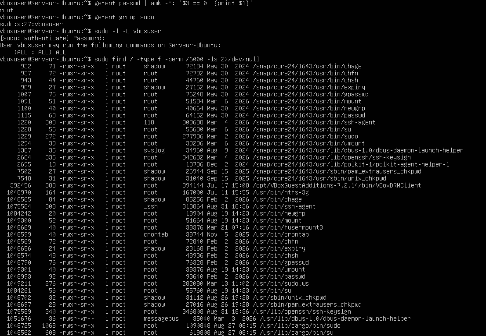
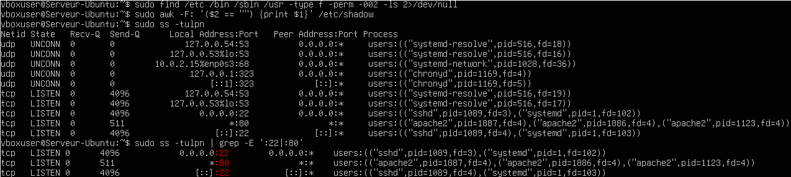

# Lab 09 — Audit de sécurité du système

## Objectif

Réaliser un premier contrôle de sécurité du serveur Ubuntu en vérifiant les privilèges de l’utilisateur courant ainsi que les services accessibles et les ports ouverts sur le système.

## Environnement

- Ubuntu Server
- OpenSSH
- Apache2
- Outils d’audit Linux

## Affichage des privilèges utilisateurs

Une vérification a été effectuée afin d’identifier l’utilisateur connecté, son UID, son GID et les groupes auxquels il appartient, notamment le groupe `sudo`.

Commandes utilisées :

```bash
whoami
id
groups
getent group sudo
```

Ces commandes permettent de confirmer l’identité de l’utilisateur courant ainsi que ses privilèges d’administration éventuels.



## Vérification des accès et des ports ouverts

Les services actifs et les ports ouverts ont été contrôlés afin d’identifier les services accessibles sur le serveur, notamment SSH et Apache.

Commandes utilisées :

```bash
sudo ss -tulpn
sudo ss -tulpn | grep -E ':22|:80'
```

Cette vérification permet de repérer les services en écoute sur le système et d’associer les ports ouverts aux processus correspondants.



## Résultat

- L’utilisateur courant a été identifié.
- Les groupes associés au compte ont été vérifiés.
- L’appartenance éventuelle au groupe `sudo` a été contrôlée.
- Les ports ouverts du système ont été listés.
- Les services SSH et Apache ont été vérifiés.

## Compétences acquises

- Identification des privilèges d’un utilisateur Linux
- Vérification de l’appartenance à un groupe
- Contrôle des accès administrateur
- Analyse des ports ouverts avec `ss`
- Vérification des services réseau exposés
